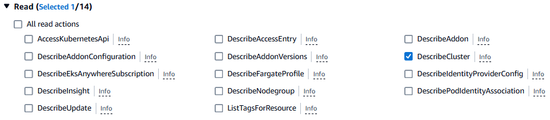

# Role-Based Access Control (RBAC)

- In any system we have two things. They are:
    1. Authentication
    2. Authorization

**Authentication** isProving you are a part of the system
**Authorization** is proving you have access to that resource

Generally we have Nouns and verbds 
- Here nouns and verbs means resources and actions 
- Resources(nouns)
    - VPC, EC2, EBS, EFS, etc 
- Actions(verbs)
    - create vpc, update vpc, get vpc, delete vpc, list vpc 

Then we have User, group, roles and permissions 

For example, we have a Datacenter -> roles and permissions 
-> everyone can enter 
-> only admins have server creation
-> users have listing servers access 

Suppose take `expense` project:  
Here we have different roles
- trainee --> read access
- senior engineer --> deployment access 
- team lead --> namespace admin 
- manager  --> cluster admin access

- In RBAC, we have user, role(resource and actions), rolebinding (bind the user and role)
    - This is all authorization
- EKS uses IAM for Authentication
- what is EKS --> It is a Platform as a service which is independent

## Authentication:

Rajasekhar joined our team 
--------------------------
- Expense team will send an email to EKS admin that Rajasekhar joined our team please provide her `read` access -> Give her read access to expense namespace

Then what administrators do? 
-> They create IAM user, create a role for rajasekhar to describe eks cluster 
-> They create role and rolebinding
-> provide access to lakshmi

we need to create user in IAM
**Create Policy** 
- Go to IAM -> Policies -> create a policy -> search for `EKS` service -> In the drop down `read` -> click the check box for `DescribeCluster`

- Resources -> specific -> Click on `Add ARNs` -> specify ARN(s) -> Give Resource region as `us-east-1`  and Resource Cluster Name as `expense` -> click on add ARNs

- click on next 
- Review and create -> give the policy name as `DescribeExpenseEKSCluster` -> click on create policy

- search for `expense` in policies which describes the details 

**Create User**
-> create an user (eg., lakshmi)
-> click on attach policies directly -> DescribeExpenseEKSCluster 
-> click on next -> create user 

create a folder k8-admin 

RBAC -> We have an EKS cluster integrated with AWS IAM, IAM provides authentication and inside EKS we have a role and rolebinding objects to provide the authorization

rbac.yaml 
==========

apiVersion: rbac.authorization.k8s.io/v1
kind: Role
metadata:
  namespace: expense
  name: expense-trainee
rules:
- apiGroups: [""] # "" indicates the core API group
  resources: ["pods"]
  verbs: ["get", "watch", "list"]
---
apiVersion: rbac.authorization.k8s.io/v1
kind: RoleBinding
metadata:
  name: expense-trainee
  namespace: expense
roleRef:
  apiGroup: rbac.authorization.k8s.io
  kind: Role
  name: expense-trainee
subjects:
- apiGroup: rbac.authorization.k8s.io
  kind: User
  name: lakshmi

-> kubectl create namespace expense
-> kubectl apply -f rbac.yaml 
-> kubectl get role -n expense 
-> kubectlget rolebinding -n expense 

-> Here, EKS and IAM are two different systems 
-> How can we know these two have to taken from EKS IAM -> there is something called aws-auth config map inside kube-system namespace

-> kubectl get configmap aws-auth -n kube-system 
-> kubectl get configmap aws-auth -n kube-system -o yaml 

aws-auth.yaml 
=============

apiVersion: v1
data:
  mapRoles: |
    - groups:
      - system:bootstrappers
      - system:nodes
      rolearn: arn:aws:iam::315069654700:role/eksctl-expense-nodegroup-expense-NodeInstanceRole-s5iLLwbCscFS
      username: system:node:{{EC2PrivateDNSName}}
  mapUsers: |
    - groups:
      - expense-trainee
      userarn: arn:aws:iam::315069654700:user/suresh (copy the IAM user arn)
      username: lakshmi
kind: ConfigMap
metadata:
  creationTimestamp: "2024-11-06T02:05:11Z"
  name: aws-auth
  namespace: kube-system
  uid: 7c41c4b2-f380-4fe0-91b7-6035fd37f2dc

-> kubectl apply -f aws-auth.yaml 
-> kubectl get configmap aws-auth -n kube-system -o yaml

let us imagine, they have a one client server for expense team  
-> create an instance -> expense 

-> now take the IP address of expense instance and login into the server 
-> aws configure 
-> aws sts get-caller-identity (we will get the lakshmi as the login user)

kubectl installation -> this should done in the created user
----------------------
make sure you are out of the git 
-> curl -O https://s3.us-west-2.amazonaws.com/amazon-eks/1.31.0/2024-09-12/bin/linux/amd64/kubectl
-> chmod +x ./kubectl
-> sudo mv kubectl /usr/local/bin/kubectl
-> kubectl version 

-> aws eks update-kubeconfig --region us-east-1 --name expense 
-> ls -la 
-> cd .kube/
-> cat config 
-> kubectl get nodes 

IAM checks whether user have expense EKS cluster access or not 

-> kubectl get pods -> user don't have access to the default namespace
-> kubectl get pods -n expense -> user have access to expense namespace

In rbac.yaml 
=============

apiVersion: rbac.authorization.k8s.io/v1
kind: Role
metadata:
  namespace: expense
  name: expense-trainee
rules:
- apiGroups: [""] # "" indicates the core API group
  resources: ["pods"]
  verbs: ["get", "watch", "list"]
---
apiVersion: rbac.authorization.k8s.io/v1
kind: RoleBinding
metadata:
  name: expense-trainee
  namespace: expense
roleRef:
  apiGroup: rbac.authorization.k8s.io
  kind: Role
  name: expense-trainee
subjects:
- apiGroup: rbac.authorization.k8s.io
  kind: User
  name: lakshmi
---
apiVersion: rbac.authorization.k8s.io/v1
kind: Role
metadata:
  namespace: expense
  name: expense-admin
rules:
- apiGroups: ["*"] # "" indicates the core API group
  resources: ["*"]
  verbs: ["*"]
---
apiVersion: rbac.authorization.k8s.io/v1
kind: RoleBinding
metadata:
  name: expense-admin
  namespace: expense
roleRef:
  apiGroup: rbac.authorization.k8s.io
  kind: Role
  name: expense-admin
subjects:
- apiGroup: rbac.authorization.k8s.io
  kind: User
  name: venkatesh
  

In aws-auth.yaml 
=============

apiVersion: v1
data:
  mapRoles: |
    - groups:
      - system:bootstrappers
      - system:nodes
      rolearn: arn:aws:iam::315069654700:role/eksctl-expense-nodegroup-expense-NodeInstanceRole-s5iLLwbCscFS
      username: system:node:{{EC2PrivateDNSName}}
  mapUsers: |
    - groups:
      - expense-trainee
      userarn: arn:aws:iam::315069654700:user/lakshmi (copy the IAM user arn)
      username: lakshmi
	- groups:
      - expense-admin
      userarn: arn:aws:iam::315069654700:user/venkatesh (copy the IAM user arn)
      username: venkatesh 
kind: ConfigMap
metadata:
  creationTimestamp: "2024-11-06T02:05:11Z"
  name: aws-auth
  namespace: kube-system
  uid: 7c41c4b2-f380-4fe0-91b7-6035fd37f2dc

-> create an user venkatesh 
-> attach policy directly -> DescribeExpenseEKSCluster 
-> click on next 
-> click on create user 

-> create an access key for venkatesh 

In workstaion instance (i.e administartor)

-> kubectl apply -f rbac.yaml 
-> kuebctl apply -f aws-auth.yaml 

And now in expense instance 
-> aws configure (enter ther user venkatesh credentials)
-> aws sts get-caller-identity 
-> aws eks update-kubeconfig --region us-east-1 --name expense 
-> kubectl get nodes (they don't have access to default namespace)
-> kubectl get pods -n expense 
-> kubectl get deployments -n expense 
-> kubectl get services -n expense 
-> kubectl api-resources 

-> By using this expense namespace we can get the pvc becoz this is user activity 
-> we cannot get the pv becoz that is admin activity and this is cluster level 

-> role and rolebinding have namespace level access 
-> cluster role and cluster rolebinding are cluster level access 

In rbac.yaml 
-------------

apiVersion: rbac.authorization.k8s.io/v1
kind: Role
metadata:
  namespace: expense
  name: expense-trainee
rules:
- apiGroups: [""] # "" indicates the core API group
  resources: ["pods"]
  verbs: ["get", "watch", "list"]
---
apiVersion: rbac.authorization.k8s.io/v1
kind: RoleBinding
metadata:
  name: expense-trainee
  namespace: expense
roleRef:
  apiGroup: rbac.authorization.k8s.io
  kind: Role
  name: expense-trainee
subjects:
- apiGroup: rbac.authorization.k8s.io
  kind: User
  name: lakshmi
---
apiVersion: rbac.authorization.k8s.io/v1
kind: Role
metadata:
  namespace: expense
  name: expense-admin
rules:
- apiGroups: ["*"] # "" indicates the core API group
  resources: ["*"]
  verbs: ["*"]
---
apiVersion: rbac.authorization.k8s.io/v1
kind: RoleBinding
metadata:
  name: expense-admin
  namespace: expense
roleRef:
  apiGroup: rbac.authorization.k8s.io
  kind: Role
  name: expense-admin
subjects:
- apiGroup: rbac.authorization.k8s.io
  kind: User
  name: venkatesh
---
apiVersion: rbac.authorization.k8s.io/v1
kind: ClusterRole
metadata:
  name: expense
rules:
- apiGroups: [""]
  resources: ["nodes","persistentvolumes","namespaces"]
  verbs: ["get","list","watch"]
---
apiVersion: rbac.authorization.k8s.io/v1
# This cluster role binding allows anyone in the "manager" group to read secrets in any namespace.
kind: ClusterRoleBinding
metadata:
  name: expense
subjects:
- kind: User
  name: venkatesh # Name is case sensitive
  apiGroup: rbac.authorization.k8s.io
roleRef:
  kind: ClusterRole
  name: expense
  apiGroup: rbac.authorization.k8s.io
  
  
-> kubectl apply -f rbac.yaml 

And in expense instance 
-> kubectl get nodes 
-> kubectl get pv 

when interviewer asks for RBAC 
A) In our project, EKS cluster we map and create an IAM user and we will provide the describecluster access and we have role & rolebinding to give namespace level access and we have the clusterrole & clusterrolebinding to provide the cluster level access and we will use aws config map in kube-system namespace to map the IAM user to EKS 
-> This is all admin activity 

taints and tolerations -> imporatant for interviews
----------------------------------------------------

we have a kube-scheduler -> this is master node component 
-> whenever we type kubectl apply -f manifest.yaml, first it checks for authentication 
that if you have any access to apply. It scans for resources and checks if you have access or not that is decided by the kubernetes. It confirms that if you have access and then it hand over to kube-scheduler 

-> kube-scheduler checks for worker nodes and whichever worker node is free and it allocates tha randome one 

eg:

nodeSelector:
	az: us-east-1b 
	

taint --> paint 

example: 
-> banks and RBI may accept painted notes -> it means they can tolerate (tolerate in the sense excuse)

-> you can taint the node(it means it is polluted). for suppose if you tainted any node, then kube-scheduler will not schedule any pod inside that node 
-> kube-scheduler cannot schedule any pod in that node 
-> GPU based servers are required for expense project 
-> taint these GPU nodes 
-> expense project users should give toleration in their manifest files 
-> tolerations are written by users in expense project 
-> manily taints and tolerations means rejecting that other project related pods  are not allowed to nodes 

-> Taints are opposite -> tehy allow a node to repel a set of pods 
-> Tolerations are applied to pods. Tolerations allow the scheduler to schedule pods with matching taints 
-> Tolerations allow scheduling but don't guarantee scheduling 

1. EKS is integrated with IAm for authentication 
2. aws-auth configmap 

1. make sure IAM user exist and he have cluster describe access 
2. create role and rolebinding 
3. edit aws-auth configmap

